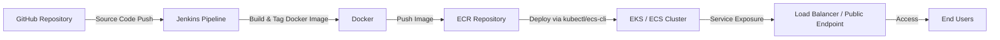

# 🚀 Automated Deployment of Flask Web Application using CI/CD, IaC, and AWS  

## 📌 Project Overview  
This project demonstrates the **end-to-end automation of a Flask web application** using modern DevOps practices.  

The goal is to:  
- Containerize the application with **Docker**  
- Automate build and deployment with **Jenkins CI/CD pipeline**  
- Push images to **Amazon ECR**  
- Deploy onto **Amazon EKS/ECS** (managed Kubernetes / container orchestration)  
- Use **Terraform** for Infrastructure as Code (VPC, subnets, NAT gateway, IAM, etc.)  

This project simulates a **real-world DevOps workflow** and prepares the application for **scalable and secure production deployment**.  

---

## 🛠️ Tech Stack  
- **Language / Framework:** Python (Flask)  
- **CI/CD Tool:** Jenkins  
- **Containerization:** Docker  
- **Container Registry:** Amazon Elastic Container Registry (ECR)  
- **Orchestration:** Amazon Elastic Kubernetes Service (EKS) / Amazon ECS  
- **Infrastructure as Code:** Terraform  
- **Cloud Provider:** AWS  

---

## ⚙️ Architecture  

## 📂 Project Structure

├── app/                      # Flask application source code
│   ├── app.py
│   ├── requirements.txt
│   └── Dockerfile
├── k8s/                      # Kubernetes manifests
│   ├── flask-deployment.yaml
│   └── flask-service.yaml
├── jenkins/                  # Jenkins pipeline script
│   └── Jenkinsfile
├── terraform/                # Infrastructure as Code
│   ├── vpc.tf
│   ├── eks.tf
│   └── iam.tf
└── README.md                 # Project documentation

## 🚀 Deployment Workflow  

### 1️⃣ Source Code Management  
- Developers commit Flask app code to **GitHub** repository.  

### 2️⃣ CI/CD Pipeline (Jenkins)  
- **Stage 1:** Checkout code from GitHub  
- **Stage 2:** Build Docker image and tag it  
- **Stage 3:** Push image to Amazon ECR  
- **Stage 4:** Deploy the image to EKS/ECS using `kubectl` or ECS service update  

### 3️⃣ AWS Infrastructure Setup (Terraform)  
- VPC with public & private subnets  
- NAT Gateway for private subnet internet access  
- IAM Roles for EKS/ECS & Jenkins  
- EKS Cluster and Node Groups (or ECS Cluster with services & tasks)  

### 4️⃣ Deployment  
- Application is deployed as a **Kubernetes Deployment + Service** on EKS  
- Service is exposed via a **Load Balancer**  
- Users can access the application through the public endpoint  

---

## ✅ Key Features  
- **End-to-End CI/CD** automation  
- **Scalable** deployment using Kubernetes/ECS  
- **Secure** private subnets with NAT Gateway  
- **Portable** through Docker containerization  
- **Infrastructure as Code** using Terraform  

---

## ⚡ Challenges & Learnings  
- **EKS connectivity issues:** Solved by configuring NAT Gateway & updating kubeconfig  
- **ECS deployment failure (Circuit Breaker):** Debugged container health checks and ports  
- **Pipeline automation:** Learned Jenkins AWS integration with `withAWS` plugin  

---

## 🔮 Future Enhancements  
- Add **Prometheus & Grafana** for monitoring  
- Implement **Horizontal Pod Autoscaler** in Kubernetes  
- Introduce **AWS CloudFront + Route53** for global scaling & DNS management  
- Add **Secrets Manager** for managing credentials  

---

## 📊 Completion Status  
- ✅ Phase 1: Infrastructure Setup with Terraform  
- ✅ Phase 2: Flask App + Docker  
- ✅ Phase 3: ECR Repository Setup  
- ✅ Phase 4: Jenkins CI/CD Pipeline  
- ✅ Phase 5: Deployment on EKS  
- ⚡ Phase 6: ECS Deployment (in-progress)  
- 🔮 Phase 7: Monitoring & Scaling (planned)  
